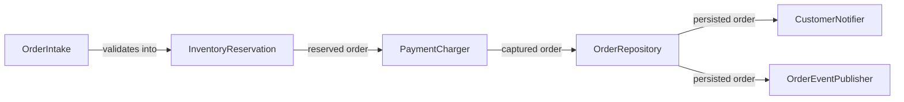

# Self-verification — Phase 7

Three artifacts must be produced before Phase 8's human gate.

## 1. Rubric-scored self-review (analytic rubric, 4-point scale)

Score each criterion 1–4. Total /24.

| Criterion | 4 (Excellent) | 3 (Proficient) | 2 (Developing) | 1 (Beginning) |
|---|---|---|---|---|
| **Decomposition completeness** | Every E2E pipeline stage from Phase 1 has a method node | All major stages, ≤1 minor gap | Several gaps | Many missing or stages bundled wrong |
| **Docstring quality** | All 9 fields filled meaningfully on every method | All 9 fields, occasional thin field | Some fields missing or generic | Many missing or placeholder text |
| **Interface cohesion** | Cohesion test passes on every interface | Cohesion test passes on most | Some interfaces are grab-bags | God-interfaces present |
| **Dependency direction** | Acyclic, layered, justified | Acyclic but some questionable edges | One cycle present | Multiple cycles or unclear direction |
| **Validation status** | Phase 6 passed cleanly | Phase 6 passed with warnings | Phase 6 had to be re-run | Phase 6 unresolved at submission |
| **Plan coverage** | Every Phase-1 in-scope feature has interface coverage | Almost all | Several features unaddressed | Many gaps |

Render as the table above with two extra columns appended on the right:

| Score | Notes |
|---|---|
| 1–4 | One-line justification with concrete reference (interface or method name) |

## Failure handling at Phase 7.1

If any criterion scores **1 (Beginning)**, STOP and report to the user
before emitting the Phase 7.3 visual artifacts. The user may want to
revise (return to the relevant Phase) rather than proceed to the human
gate with a known-weak architecture.

## 2. Human-confirmation checklist (single-point rubric)

Print this verbatim in the chat (also embedded in the HTML report's
"Reviewer checklist" section):

```
Reviewer checklist — please verify each:

[ ] The decomposition table in Phase 3 matches the interfaces actually
    emitted in Phase 5
[ ] Every method has all 9 docstring fields (skim 3 random methods to
    spot-check)
[ ] No interface looks like a grab-bag of unrelated methods
[ ] The Mermaid DAG (architecture.mmd) is acyclic
[ ] No method body has been written (interface-only)
[ ] The HTML report (architecture.html) opens locally and renders without
    errors
[ ] The validation command (Phase 6) passed — see
    .architect-state.json: validation_status

Above-bar comments (optional):
Below-bar comments (REQUIRED if any box unchecked):
```

## 3. Visual outputs

### Mermaid dependency DAG

Generated from `.architect-state.json`:

```bash
python3 "${CLAUDE_SKILL_DIR}/scripts/render_mermaid_dag.py" \
  .architect-state.json > architecture.mmd
```

Edges come from each method's `Collaborators` field. Format:



If the DAG contains a cycle, that's a Phase 7.1 "Dependency direction"
score of 1–2; surface explicitly and recommend revision.

### Self-contained HTML report

Generated from `.architect-state.json`:

```bash
python3 "${CLAUDE_SKILL_DIR}/scripts/render_html_report.py" \
  .architect-state.json > architecture.html
```

The HTML renders:

- Project goal + plan synthesis (from Phase 1)
- Package tree (from Phase 2)
- Interface table with method docstrings expandable per interface
  (from Phase 5)
- Embedded Mermaid DAG (rendered via mermaid.js from CDN)
- Rubric scores (from Phase 7.1)
- Reviewer checklist (from Phase 7.2)

The report uses mermaid.js loaded from a CDN; everything else is inline.
First load requires network; subsequent loads work from browser cache.

## Commit Phase 7 outputs

```bash
git add architecture.mmd architecture.html
git commit -m "docs(architect): self-verification artifacts"
```

Update state: `phase_completed: artifacts_emitted`.
