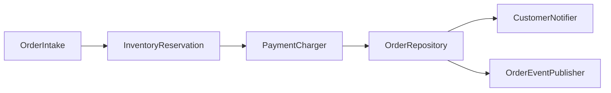

# Self-verification — Phase 7

Three artifacts must be produced before Phase 8's human gate.

## 1. Rubric-scored self-review (analytic rubric, 4-point scale)

Score each criterion 1–4. Total /24.

| Criterion | 4 (Excellent) | 3 (Proficient) | 2 (Developing) | 1 (Beginning) |
|---|---|---|---|---|
| **Decomposition completeness** | Every E2E pipeline stage from Phase 1 has a method node; no "method-shaped class" wrappers hiding multi-stage logic | All major stages, 1 minor gap | 2–3 stages missing or stages bundled into multi-purpose methods | 4+ missing or method-shaped class present |
| **Docstring quality** | All 9 fields filled meaningfully on every method | All 9 fields, ≤3 thin fields across the whole skeleton | Some fields missing on some methods, or many fields generic/placeholder | Many methods missing fields, or async-semantics gaps (per docstring-schema.md) |
| **Interface cohesion** | Cohesion test passes on every interface; no god-interfaces (7+ unrelated methods) | Cohesion test passes on all but 1 interface | 2–3 interfaces fail the cohesion test or look like grab-bags | God-interfaces present, or majority fail cohesion |
| **Dependency direction** | Acyclic, layered, every edge justified | Acyclic but 1–2 questionable edges | One cycle present | Multiple cycles or unclear direction |
| **Validation status** | Phase 6 passed cleanly first run | Phase 6 passed with warnings | Phase 6 had to be re-run after a fix | Phase 6 unresolved at submission |
| **Plan coverage** | Every Phase-1 in-scope feature has interface coverage; every interface traces back to a feature | All but 1 feature covered | 2–3 features unaddressed | 4+ gaps |

Render as the table above with two extra columns appended on the right:

| Score | Notes |
|---|---|
| 1–4 | One-line justification with concrete reference (interface or method name) |

## Failure handling at Phase 7.1

If any criterion scores **1 (Beginning)**, STOP and report to the user
before emitting the Phase 7.3 visual artifacts. The user may want to
revise (return to the relevant Phase) rather than proceed to the human
gate with a known-weak architecture.

## 2. Human-confirmation checklist (single-point rubric)

Print this verbatim in the chat (also embedded in the HTML report's
"Reviewer checklist" section):

```
Reviewer checklist — please verify each:

[ ] The decomposition table in Phase 3 matches the interfaces actually
    emitted in Phase 5
[ ] Every method has all 9 docstring fields (skim 3 random methods to
    spot-check; the HTML report shows them inline so no source-dive needed)
[ ] No interface looks like a grab-bag of unrelated methods
[ ] The Mermaid DAG (architecture.mmd) is acyclic
[ ] No method body has been written (interface-only)
[ ] The validation command (Phase 6) passed — see
    .architect-state.json: validation_status

(The embedded checklist inside architecture.html omits an explicit
"HTML opens" item because the report has no JavaScript and degrades to
plain text in any browser — render failure isn't a meaningful state.)

Above-bar comments (optional):
Below-bar comments (REQUIRED if any box unchecked):
```

## 3. Visual outputs

### Mermaid dependency DAG

Generated from `.architect-state.json`:

```bash
python3 "${CLAUDE_SKILL_DIR}/scripts/render_mermaid_dag.py" \
  .architect-state.json > architecture.mmd
```

Edges come from each method's `Collaborators` field. Edge labels are
NOT emitted — the schema does not carry per-edge label text. Format:



Interface name labels are emitted with Mermaid-safe escaping
(`#quot;` for quotes, `&lt;`/`&gt;` for angle brackets, etc.) so that
hand-edited state files with malicious names cannot inject Mermaid
`click` directives when the `.mmd` file is rendered downstream.

If the DAG contains a cycle, that's a Phase 7.1 "Dependency direction"
score of 1–2; surface explicitly and recommend revision.

### HTML report

Generated from `.architect-state.json`:

```bash
python3 "${CLAUDE_SKILL_DIR}/scripts/render_html_report.py" \
  .architect-state.json > architecture.html
```

The HTML renders:

- Project goal + plan synthesis (from Phase 1)
- Package tree (from Phase 2)
- Interface table with method docstrings expandable per interface
  (from Phase 5)
- Mermaid DAG **as inline plain text** inside a `<pre>` block — NOT
  rendered as a diagram in the page. The report is fully self-contained
  (no CDN, no external scripts, no JS at all) so it cannot be a vector
  for XSS via crafted interface names in the state file. To see the
  rendered diagram, paste the Mermaid block into `mermaid.live`,
  `mermaid-cli`, or the sibling `architecture.mmd` file.
- Rubric scores (from Phase 7.1)
- Reviewer checklist (from Phase 7.2) — embedded directly in the HTML
  so an offline reviewer can verify without re-opening the chat session.

## Commit Phase 7 outputs

```bash
git add architecture.mmd architecture.html
git commit -m "docs(architect): self-verification artifacts"
```

Update state: `phase_completed: artifacts_emitted`.
